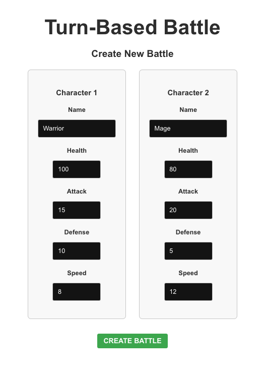
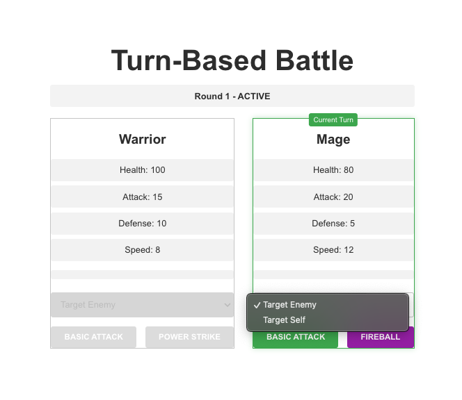

# Turn-Based Battle Game

A turn-based battle game featuring a React TypeScript frontend and Go backend. Players can create characters and engage in strategic combat using basic attacks and special abilities with cooldown mechanics.

## Features

- Character creation with customizable stats (Health, Attack, Defense, Speed)
- Turn-based combat system with speed-based initiative
- Special abilities with cooldown mechanics
- Real-time battle state updates
- Modern React TypeScript frontend
- Efficient Go backend

## Screenshots

| Character Selection | Active Battle |
|:---:|:---:|
|  |  |

## Tech Stack

### Frontend
- React
- TypeScript
- Jest & React Testing Library
- Modern CSS styling

### Backend
- Go
- RESTful API architecture

## Getting Started

### Prerequisites
- Node.js (v14 or higher)
- Go (v1.16 or higher)
- Make

### Installation

1. Clone the repository:
```bash
git clone https://github.com/MaterDev/golang_turnbased_game_spike.git
cd golang_turnbased_game_spike
```

2. Start the backend server:
```bash
make run-backend
```

3. Start the frontend development server:
```bash
make run-frontend
```

4. Visit `http://localhost:3000` in your browser to play the game.

## Game Rules

1. Characters take turns based on their Speed attribute
2. Each character has two abilities:
   - Basic Attack: Always available
   - Special Attack: Has a cooldown period
3. Combat continues until one character's health reaches 0
4. The character with higher Speed acts first

## Development

The project uses a Makefile for common development tasks:

```bash
make run-backend     # Start the Go backend server
make run-frontend    # Start the React development server
make test-backend    # Run backend tests
make test-frontend   # Run frontend tests
```

## License

This work is licensed under the Creative Commons Attribution-NonCommercial-ShareAlike 4.0 International License (CC BY-NC-SA 4.0). This means you are free to:

- Share: Copy and redistribute the material in any medium or format
- Adapt: Remix, transform, and build upon the material

Under the following terms:
- Attribution: You must give appropriate credit
- NonCommercial: You may not use the material for commercial purposes
- ShareAlike: If you remix, transform, or build upon the material, you must distribute your contributions under the same license

For more information, visit: https://creativecommons.org/licenses/by-nc-sa/4.0/

## Acknowledgments

This project was created with assistance from:
- Codeium - AI-powered code completion and analysis
- Windsurf - The world's first agentic IDE

## Project Status

This is a prototype/spike implementation of a turn-based battle system. While functional, it's intended as a demonstration and learning tool rather than a production-ready game.
